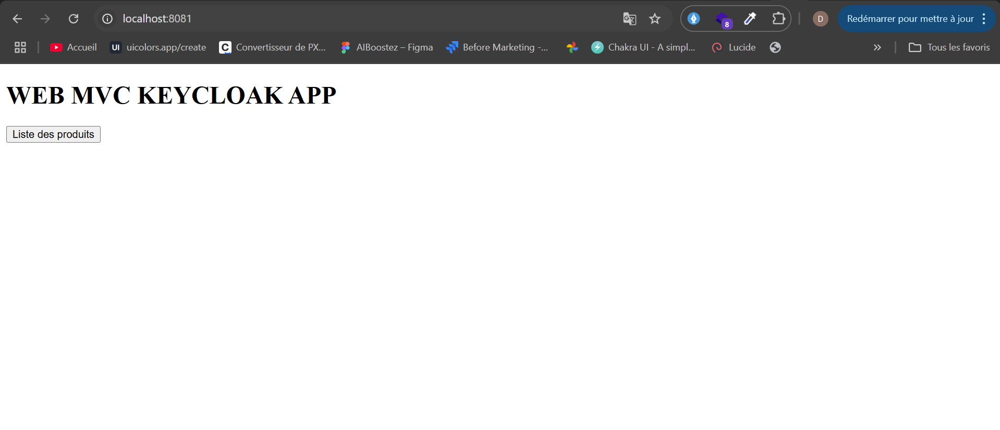
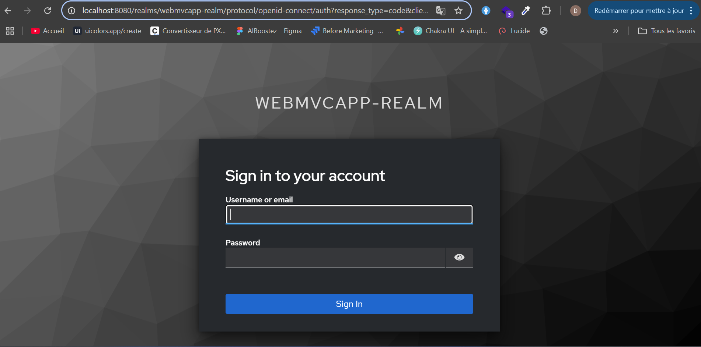
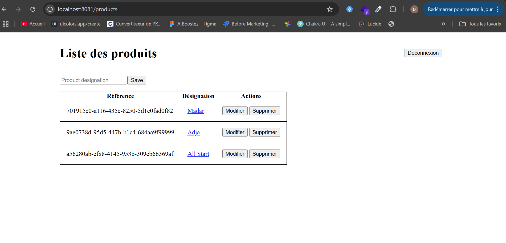

# **David GABIAM**

# Pratique maven

Ce projet met en pratique **spring mvc** et la gestion de la sécurité avec **Keycloak**.

1. Créer une application web maven
2. Ajouter les dependances spring MVC
3. Gérer lajout et la liste dans une base de donnees avec une classe : Product(ref String, name String)
4. Gérer la securite avec keycloak

✍ **Auteur** : @mrDav90
